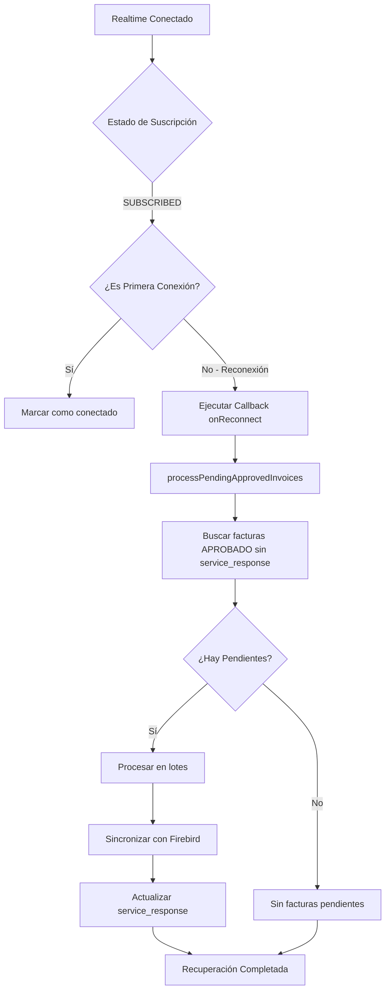

# 🔄 Recuperación Automática Post-Reconexión de Realtime

## 📋 Descripción

Cuando el servicio de Supabase Realtime se desconecta (por caída de red, reinicio del servidor, etc.) y luego se reconecta, el sistema **automáticamente verifica y procesa todas las facturas en estado APROBADO** que quedaron pendientes durante la desconexión.

Esto garantiza que **ninguna factura se pierda** aunque haya interrupciones en la conexión.

---

## 🎯 Problema Resuelto

### ❌ Antes (Sin Recuperación Post-Reconexión)

```
1. Servicio conectado a Realtime ✅
2. Usuario aprueba Factura #1 → Se sincroniza ✅
3. ⚠️ Realtime se desconecta (caída de red)
4. Usuario aprueba Factura #2 → ❌ NO se sincroniza (Realtime caído)
5. Usuario aprueba Factura #3 → ❌ NO se sincroniza (Realtime caído)
6. Realtime se reconecta ✅
7. Usuario aprueba Factura #4 → Se sincroniza ✅
8. ❌ Facturas #2 y #3 quedan SIN SINCRONIZAR hasta reiniciar el servicio
```

### ✅ Ahora (Con Recuperación Post-Reconexión)

```
1. Servicio conectado a Realtime ✅
2. Usuario aprueba Factura #1 → Se sincroniza ✅
3. ⚠️ Realtime se desconecta (caída de red)
4. Usuario aprueba Factura #2 → ❌ NO se sincroniza (Realtime caído)
5. Usuario aprueba Factura #3 → ❌ NO se sincroniza (Realtime caído)
6. Realtime se reconecta ✅
7. 🔄 Sistema detecta reconexión y ejecuta recuperación automática
8. ✅ Factura #2 se sincroniza
9. ✅ Factura #3 se sincroniza
10. Usuario aprueba Factura #4 → Se sincroniza ✅
11. ✅ TODAS las facturas sincronizadas correctamente
```

---

## 🔧 Implementación Técnica

### 1. Modificación en `supabaseClient.js`

Se agregó un parámetro `onReconnect` al método `setupRealtimeListener`:

```javascript
setupRealtimeListener(callback, onReconnect = null) {
  let isFirstConnection = true;
  
  // ...
  
  .subscribe((status, err) => {
    if (status === 'SUBSCRIBED') {
      // Si es una reconexión (no la primera conexión)
      if (!isFirstConnection && onReconnect) {
        logger.info('🔄 Reconexión detectada, ejecutando recuperación...');
        setImmediate(async () => {
          await onReconnect();
        });
      }
      
      isFirstConnection = false;
    }
  });
}
```

### 2. Modificación en `syncService.js`

Se pasó un callback de reconexión que ejecuta `processPendingApprovedInvoices()`:

```javascript
this.supabaseClient.setupRealtimeListener(
  async (invoice) => {
    // Procesar cambios en tiempo real
    await this.processApprovedInvoice(invoice);
  },
  async () => {
    // Callback de reconexión
    logger.info('🔄 Reconexión detectada, verificando facturas pendientes...');
    const result = await this.processPendingApprovedInvoices();
    
    if (result.processed > 0) {
      logger.info(`✅ Recuperación: ${result.processed} facturas sincronizadas`);
    }
  }
);
```

---

## 📊 Flujo de Recuperación



---

## 🧪 Pruebas

### Script de Prueba

```bash
node src/scripts/testReconnectRecovery.js
```

Este script:
1. ✅ Conecta al Realtime
2. ✅ Configura callback de reconexión
3. ✅ Muestra cuántas facturas pendientes hay
4. ✅ Detecta reconexiones automáticamente

### Prueba Manual

1. **Iniciar el servicio:**
   ```bash
   node src/index.js
   ```

2. **Simular desconexión:**
   - Desactivar Realtime en Supabase Dashboard
   - O desconectar la red temporalmente

3. **Aprobar facturas mientras está desconectado:**
   - Cambiar 2-3 facturas a estado `APROBADO`

4. **Reconectar:**
   - Reactivar Realtime
   - O reconectar la red

5. **Verificar logs:**
   ```
   🔄 Reconexión detectada, verificando facturas pendientes...
   ✅ Recuperación: 3 facturas sincronizadas, 0 errores
   ```

---

## 📝 Logs Esperados

### Conexión Inicial
```
✅ Listener de Supabase Realtime SUSCRITO exitosamente
```

### Reconexión Detectada
```
🔄 Reconexión de Realtime detectada, verificando facturas pendientes...
Iniciando recuperación de facturas aprobadas pendientes...
Procesando lote 1 de 1 (3 facturas)
Factura recuperada exitosamente: FAC-001 (1/3)
Factura recuperada exitosamente: FAC-002 (2/3)
Factura recuperada exitosamente: FAC-003 (3/3)
✅ Recuperación post-reconexión: 3 facturas sincronizadas, 0 errores
```

---

## ⚙️ Configuración

La recuperación post-reconexión respeta la configuración existente:

```javascript
// En invoice_config de Supabase
{
  "enable_invoice_recovery": true,  // ← Debe estar en true
  "recovery_batch_size": 10         // Tamaño de lote para recuperación
}
```

Si `enable_invoice_recovery` está en `false`, NO se ejecutará la recuperación post-reconexión.

---

## 🔍 Detección de Facturas Pendientes

El método `processPendingApprovedInvoices()` busca facturas con:

```sql
SELECT * FROM invoices
WHERE user_id = ?
  AND estado = 'APROBADO'
  AND service_response IS NULL
ORDER BY created_at ASC
```

Esto garantiza que solo se procesen facturas que:
- ✅ Están aprobadas
- ✅ NO han sido sincronizadas (service_response es NULL)
- ✅ Pertenecen al usuario actual

---

## 🎯 Beneficios

1. ✅ **Cero pérdida de datos:** Ninguna factura se pierde por caídas de Realtime
2. ✅ **Recuperación automática:** No requiere intervención manual
3. ✅ **Procesamiento en background:** No bloquea el canal de Realtime
4. ✅ **Procesamiento por lotes:** Evita sobrecargar el sistema
5. ✅ **Logs detallados:** Fácil monitoreo y debugging

---

## 🚨 Casos de Uso

### Caso 1: Caída de Red Temporal
```
1. Red se cae → Realtime se desconecta
2. Usuario sigue trabajando y aprueba facturas
3. Red se recupera → Realtime se reconecta
4. Sistema sincroniza automáticamente todas las facturas pendientes
```

### Caso 2: Reinicio del Servidor Supabase
```
1. Supabase reinicia → Realtime se desconecta
2. Usuario aprueba facturas durante el reinicio
3. Supabase vuelve → Realtime se reconecta
4. Sistema sincroniza automáticamente todas las facturas pendientes
```

### Caso 3: Timeout de Conexión
```
1. Conexión expira por inactividad → Realtime se desconecta
2. Usuario aprueba facturas
3. Sistema reconecta automáticamente
4. Sistema sincroniza automáticamente todas las facturas pendientes
```

---

## 📌 Notas Importantes

- ⚠️ La recuperación solo se ejecuta en **reconexiones**, NO en la conexión inicial
- ⚠️ La conexión inicial ya ejecuta `processPendingApprovedInvoices()` en el método `start()`
- ⚠️ El callback se ejecuta en **background** (setImmediate) para no bloquear el canal
- ⚠️ Si `enable_invoice_recovery` está en `false`, NO se ejecuta la recuperación

---

## 🔗 Archivos Relacionados

- `src/database/supabaseClient.js` - Implementación de reconexión
- `src/services/syncService.js` - Callback de recuperación
- `src/scripts/testReconnectRecovery.js` - Script de prueba
- `docs/REALTIME_RECONNECT_RECOVERY.md` - Esta documentación

